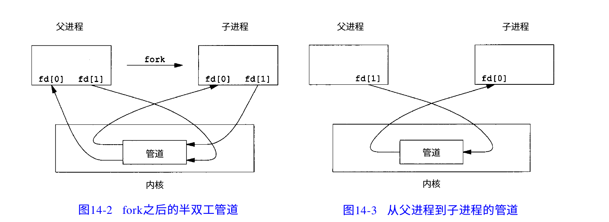

## 管道的概念
管道是操作系统中常见的一种进程间通信方式，它使用于所有POSIX系统以及Windows系列产品。

管道也是unix ipc的最老形式，管道有两种限制：

- 数据自己读不能自己写
- 它们是半双工的。数据只能在一个方向上流动。
- 数据一旦被读走，便不在管道中存在，不可反复读取。
- 它们只能在具有公共祖先的进程之间使用。通常,一个管道由一个进程创建,然后该进程调用fork,此后父、子进程之间就可应用该管道。

## 管道的创建
管道由pipe函数创建而成`pipe(pipe_fd)`经由参数pipe_fd返回两个文件描述符，pipe_fd[0]为读而打开,pipe_fd[1]为写而打开。pipe_fd[1]的输出是pipe_fd[0]的输入。

函数调用成功返回r/w两个文件描述符。无需open，但需手动close。规定：fd[0] → r； fd[1] → w，就像0对应标准输入，1对应标准输出一样。向管道文件读写数据其实是在读写内核缓冲区。

管道创建成功以后，创建该管道的进程（父进程）同时掌握着管道的读端和写端。



具体通信过程如上图所示
-  父进程调用pipe函数创建管道，得到两个文件描述符fd[0]、fd[1]指向管道的读端和写端。

- 父进程调用fork创建子进程，那么子进程也有两个文件描述符指向同一管道。

- 父进程关闭管道读端，子进程关闭管道写端。父进程可以向管道中写入数据，子进程将管道中的数据读出。由于管道是利用环形队列实现的，数据从写端流入管道，从读端流出，这样就实现了进程间通信。

## 管道的读写行为
-  如果所有指向管道写端的文件描述符都关闭了（管道写端引用计数为0），而仍然有进程从管道的读端读数据，那么管道中剩余的数据都被读取后，再次read会返回0，就像读到文件末尾一样。

- 如果有指向管道写端的文件描述符没关闭（管道写端引用计数大于0），而持有管道写端的进程也没有向管道中写数据，这时有进程从管道读端读数据，那么管道中剩余的数据都被读取后，再次read会阻塞，直到管道中有数据可读了才读取数据并返回。

- 如果所有指向管道读端的文件描述符都关闭了（管道读端引用计数为0），这时有进程向管道的写端write，那么该进程会收到信号SIGPIPE，通常会导致进程异常终止。当然也可以对SIGPIPE信号实施捕捉，不终止进程。具体方法信号章节详细介绍。

- 如果有指向管道读端的文件描述符没关闭（管道读端引用计数大于0），而持有管道读端的进程也没有从管道中读数据，这时有进程向管道写端写数据，那么在管道被写满时再次write会阻塞，直到管道中有空位置了才写入数据并返回。


## 代码实例
```c++
#include <sys/wait.h>
#include <stdio.h>
#include <stdlib.h>
#include <unistd.h>
#include <string.h>

int main() 
{
    int pipe_fd[2];
    pid_t child_pid;
    char pipe_buf;
    memset(pipe_fd, 0, sizeof(pipe_fd));

    if(pipe(pipe_fd) == -1) {
        return -1;
    }
    child_pid = fork();
    if(child_pid == -1) {
        return -1;
    }

    if(child_pid == 0) {
        close(pipe_fd[1]);
        while(read(pipe_fd[0], &pipe_buf, 1) > 0) {
            write(STDOUT_FILENO, &pipe_buf, 1);
            printf("\npipe_buf is %c\n", pipe_buf);
            printf("\nsuccess\n");
        } 
        close(pipe_fd[0]);
        return 0;
    } else {
        close(pipe_fd[0]);
        write(pipe_fd[1], "H", 1);
        close(pipe_fd[1]);
        wait(NULL);
        return 0;
    }
}
```